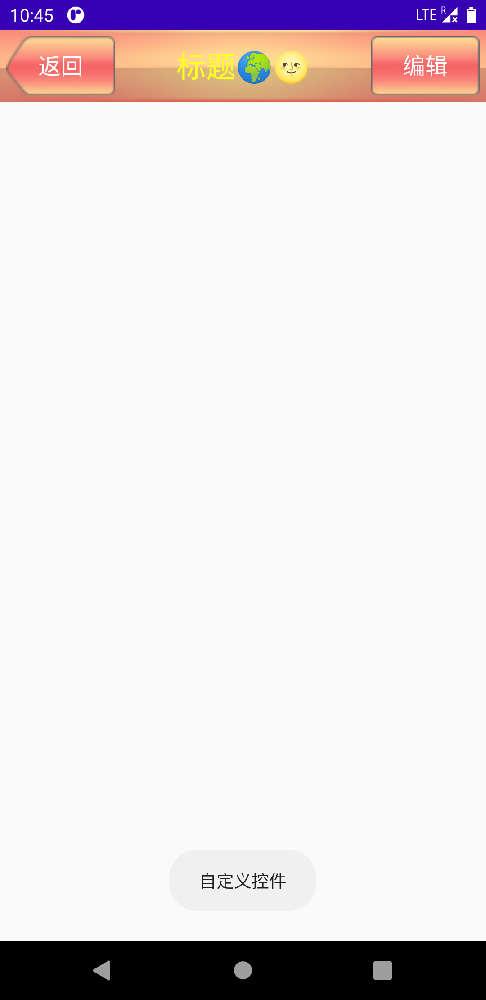
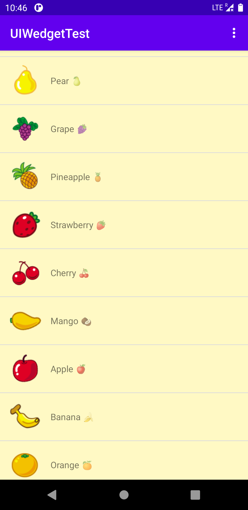
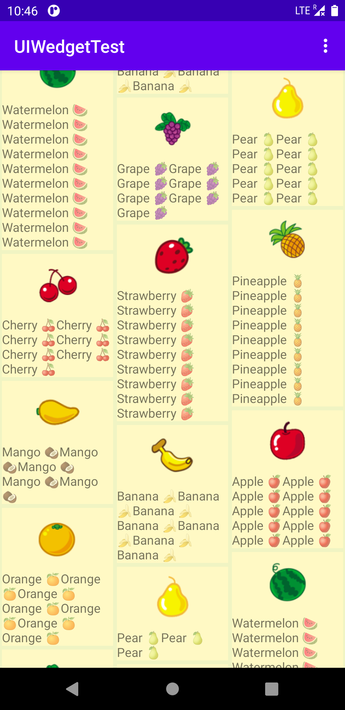
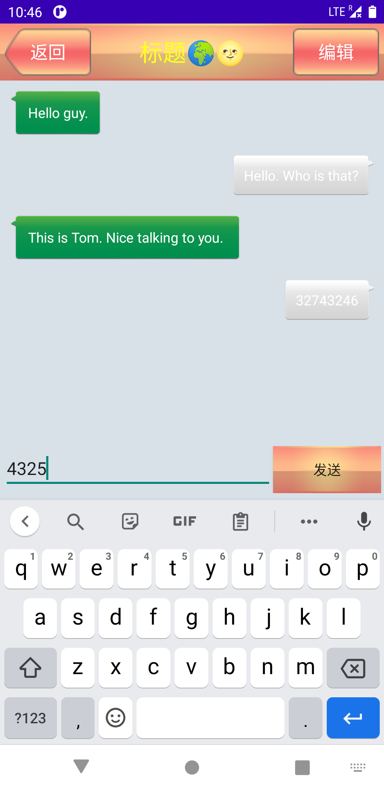

# UIWedgetTest
来源自 [「第一行代码 Android 第三版 郭霖著」](https://www.ituring.com.cn/book/2744) 第四章内容 “软件也要拼脸蛋，UI开发的点点滴滴”

注意：
Kotlin类的路径在：
```
/app/src/main/java/com/example/uiwedgettest/
```

layout文件的路径在：
```
/app/src/main/res/layout/
```
下文省略绝对路径，只写相对路径。

## 软件模块：

1. MainActivity:
   负责主页显示，与之相关的Kotlin类有：
    ```
    MainActivity.kt   
    ```

    Layout文件有：
    ```
    mainlayout.xml
    /app/src/main/res/menu/mainpage.xml
    ```

    运行截图：

2. 常见控件（对应原书4.2节）
   展示一些常见的控件，与之相关的Kotlin类有：
    ```
    BasicLayout.kt
    ```
    
    Layout文件有：
    ```
    commonwidgetlayout.xml
    ```

    运行截图： 


3. 基本布局
   使用constraintlayout形成了一个基本布局。
   与之相关的Kotlin类有：
    ```
    BasicLayout.kt
    ```
    
    Layout文件有：
    ```
    threebasiclayout.xml
    ```

    运行截图：

4. 自定义控件
    自定义了一个 iOS 6 版本的标题栏控件
    与之相关的KotLin类有：
    ```
    CustomViews.kt
    TitleLayout.kt
    ```

    Layout文件有：
    ```
    customview.xml
    title.xml
    ```

    运行截图：

5. ListView
    实现了简单的ListView Demo，可以响应点击事件
    与之相关的KotLin类有：
    ```
    ListView.kt
    FruitAdapter.kt
    Fruit.kt
    ```

    Layout文件有：
    ```
    listviewtest.xml
    fruit1tem.xml
    ```

    运行截图：

6. RecyclerView
    实现了简单的RecyclerView Demo 瀑布流形式，可以响应点击事件
    与之相关的KotLin类有：
    ```
    RecyclerView.kt
    FruitAdapter.kt
    Fruit.kt
    ```

    Layout文件有：
    ```
    recyclerview.xml
    rfruititem.xml
    ```

    运行截图：

7. 简单的聊天界面
    使用RecyclerView实现了一个简单的聊天界面
    与之相关的KotLin类有：
    ```
    ChatInterface.kt
    Msg.kt
    MsgAdapter.kt
    ```

    Layout文件有：
    ```
    chat1nterface.xml
    msg_left_item.xml
    msg_right_item.xml
    ```

    运行截图：